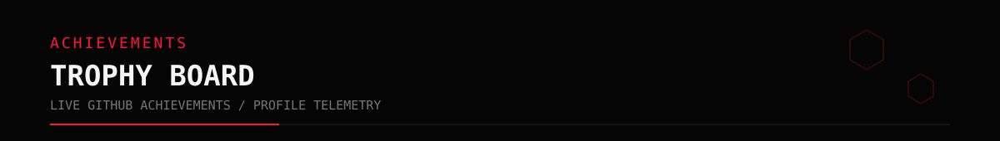

  

  
  
  

## Identity

  

  

## Selected Work

  
  

  

## Toolkit

  

### JavaScript & TypeScript Ecosystem

  

### Web, Data & Tools

  

  

## GitHub Stats

  

  

  

  

  

---

  <a href="https://github.com/LlewxamDev?tab=repositories">Repositories</a> ·
  <a href="https://github.com/LlewxamDev?tab=stars">Stars</a> ·
  <a href="https://github.com/LlewxamDev?tab=followers">Followers</a>

